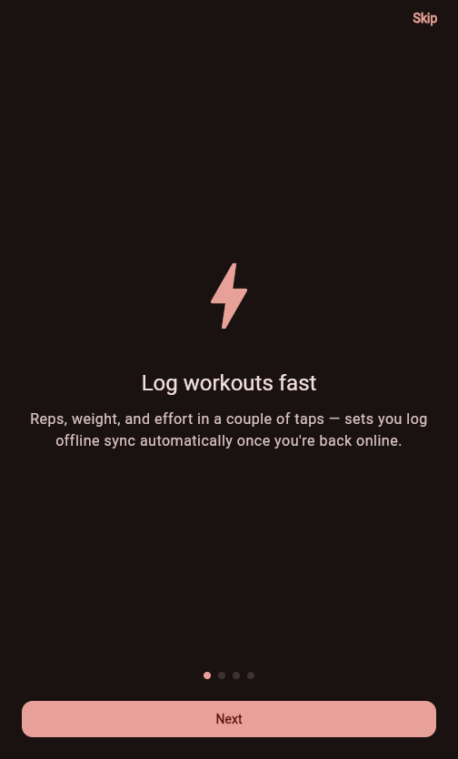
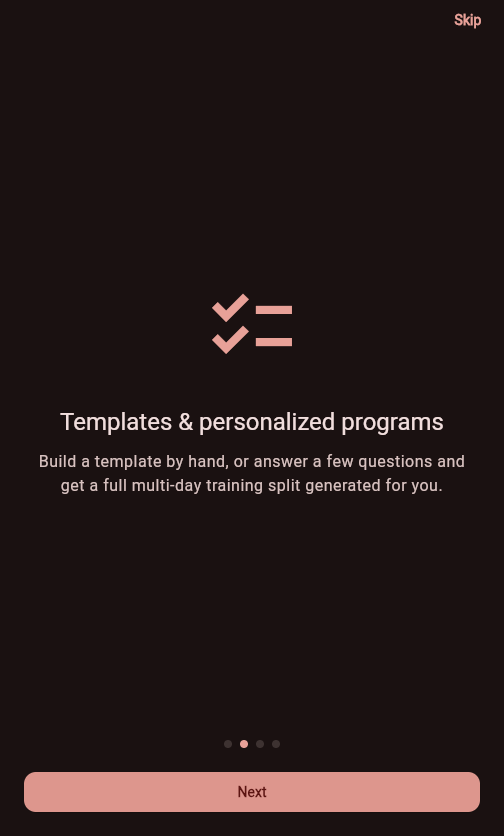
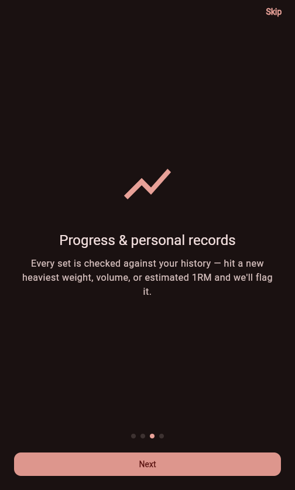
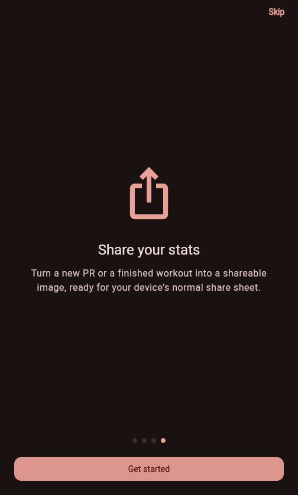
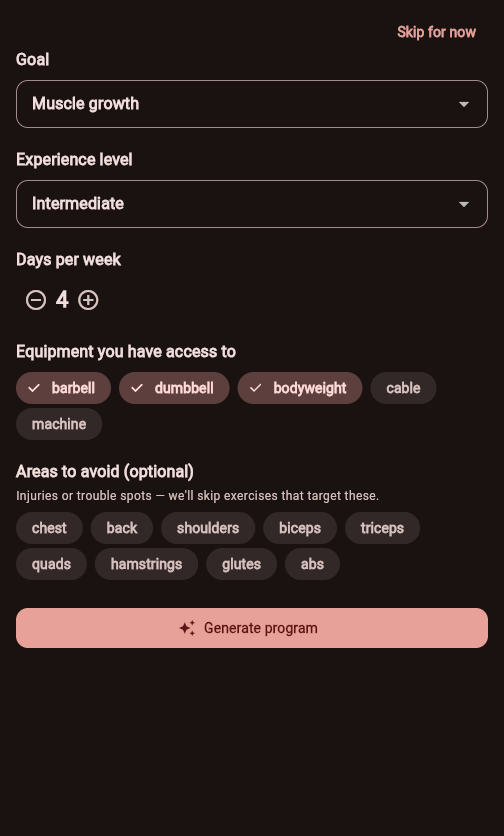
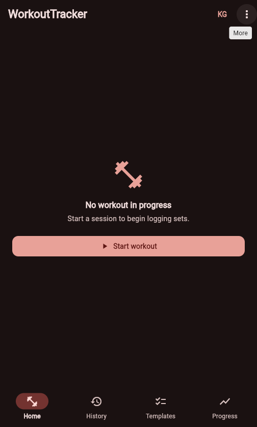

# WorkoutTracker — User Guide

Everything the app does, and how to use it. Covers the mobile app end to end, in the order you'll actually meet each screen.

## Contents

1. [Getting started](#1-getting-started)
2. [Starting a workout](#2-starting-a-workout)
3. [Logging a set](#3-logging-a-set)
4. [Supersets](#4-supersets)
5. [Templates](#5-templates)
6. [Personalized programs](#6-personalized-programs)
7. [Offline logging](#7-offline-logging)
8. [Progress & records](#8-progress--records)
9. [Coaching signals](#9-coaching-signals)
10. [Sharing your stats](#10-sharing-your-stats)
11. [Units & settings](#11-units--settings)

## 1. Getting started

Create an account with your email, a password, and a display name. Once you're in, you stay signed in — the app refreshes your session automatically, so you won't be asked to log in again until you explicitly sign out.

1. Open the app and tap **Sign up** from the login screen.
2. Enter your email, a password, and the name you want to appear in the app.
3. You're dropped straight into the home screen — no separate verification step.

  
  

Already have an account? Use **Log in** instead. To sign out at any time, open the **⋮** menu on the Home tab and tap **Log out**.

**First-run tour**: the first time you log in on a device, a short tour walks through logging workouts, templates and personalized programs, progress tracking, and sharing stats, followed by an optional prompt to fill in your goal/experience/equipment so a program can be generated for you right away. Every step can be skipped — tap **Skip** on any tour slide, or **Skip for now** on the personalization step — and you can always personalize a program later from the sparkle icon on the **Templates** tab.

  
  
  
  

  
  

The app has four main tabs at the bottom of the screen — **Home**, **History**, **Templates**, and **Progress** — everything below is organized around them.

## 2. Starting a workout

From the **Home** tab, tap **Start workout**. You'll be asked to choose:

- **Blank workout** — starts immediately with nothing planned. Add exercises as you go — the natural choice if you're training by feel today.
- **From a template** — opens your saved templates. Pick one and the app pre-loads every planned exercise as its own card, ready to log against — no need to add anything before you start.

  

Once a workout is running, the top bar shows a live elapsed-time clock and your set count for the session. Only one workout can be active at a time — finishing or starting a new one closes out the last.

**Jumping back in**: if you switch to another tab mid-workout, a slim bar appears above the bottom navigation showing your elapsed time and set count. Tap it from anywhere in the app to return straight to your active workout.

  

**Finishing up**: tap **Finish workout** at the bottom of the screen. You can add optional notes about how the session went before confirming — these are saved with the workout and visible later in your history.

## 3. Logging a set

Tap **Log set** (the floating button on an active workout) and search for an exercise, or tap one already on screen — either a planned exercise chip or an exercise card. For a template-based workout, every planned exercise already has a card waiting, even before you've logged anything against it — tap **Add set** on an empty card to get started.

  

Tapping either opens the set sheet:

1. Enter **reps** and **weight**. If you've done this exercise before, both fields pre-fill with your last set — you'll usually just need to confirm or tweak them.
2. Optionally log **RPE** (rate of perceived exertion, 1–10) — how hard that set felt. This is what powers the coaching suggestions in [Chapter 9](#9-coaching-signals).
3. Choose a **set type**, then tap **Log set**.

  

### Set types

| Type | Meaning | Counts toward PRs? |
|---|---|---|
| Normal | A working set at full effort. | Yes |
| Warm-up | Ramping up before working weight. | No |
| Drop set | Reduced weight, continued past failure. | Yes |
| Failure | Taken to muscular failure. | Yes |

Every logged set beyond a warm-up is checked against your history for three kinds of personal record: heaviest weight, best single-set volume (weight × reps), and estimated one-rep max. Beat one and a gold banner appears above your set list naming which record fell — tap the share icon on that banner to post it, see [Chapter 10](#10-sharing-your-stats).

**Plate calculator**: tap the calculator icon in the set sheet to see which plates to load per side of the bar for the weight you've entered — useful mid-set when doing the arithmetic in your head is the last thing you want to do.

**Repeat last set**: each exercise card in an active workout has a **Repeat last** button — logs another set identical to the one before it (same reps, weight, RPE, and set type) in a single tap, for straight sets across working sets.

  

**Fixing a mistake**: tap the **⋮** on any logged set to **Edit** or **Delete** it. Editing or removing a set that was holding a personal record automatically updates your records to whatever the next-best set was — nothing is left pointing at a set that no longer exists.

  

**Rest timer**: logging a set starts a rest timer automatically, shown as a countdown ring above your exercise list. Add fifteen seconds with the **+** button, or tap **Skip** to end the rest early.

## 4. Supersets

A superset links two or more exercises you alternate between with no rest in between. WorkoutTracker supports both ways people actually plan them:

- **Planned, in a template** — when building a template, tap **Group with previous** on an exercise to link it to the one above. Linked exercises show a connecting icon between their chips whenever that template is in use.
- **Ad hoc, mid-workout** — tap the link icon in the top bar during an active workout, select two or more exercises, and confirm. Every set you log for those exercises from then on is tagged as part of that group, for that session only.

A linked-set icon appears next to any set that's part of a superset, so you can see the pairing directly in your set list, not just in the planning view.

## 5. Templates

Open the **Templates** tab to see everything you've saved. From here:

- **Create one** — tap **New template**, name it, and add exercises with a target set count each. Group any of them into supersets as you go.
- **Generate a program** — tap the sparkle icon to build a whole set of templates automatically instead of one at a time — see [Chapter 6](#6-personalized-programs).
- **Start from one** — tap a template to launch a workout pre-loaded with its exercise list.
- **Delete one** — swipe or use the delete action on a template you no longer use. This doesn't touch any workouts you've already logged from it.

  
  

Once a template-based workout is running, its planned exercises appear both as a row of progress chips up top and as a full card each further down — see [Chapter 2](#2-starting-a-workout).

  

## 6. Personalized programs

Don't want to build templates by hand? Tap the sparkle icon on the **Templates** tab to generate a full multi-day training split from a short questionnaire:

1. **Goal** — strength, hypertrophy, fat loss, or general fitness. This drives the sets, reps, and exercise selection for every day.
2. **Experience level** — beginner, intermediate, or advanced.
3. **Days per week** — how many days you can train, from 1 to 6. This decides the split itself: fewer days lean toward full-body sessions, more days split into upper/lower or push/pull/legs.
4. **Equipment access** — barbell, dumbbell, bodyweight, cable, machine, or any combination. Only exercises you can actually perform are selected.
5. **Areas to avoid** — any muscle groups to leave out entirely, for working around an injury or a personal preference.

  

Tap **Generate** and the app builds a named, multi-day program — for example a 4-day Upper/Lower split — with each day saved as its own template under **Templates**, ready to start a workout from exactly like any template you built by hand. If your equipment or avoid-list is restrictive enough that a day can't be filled for a particular muscle group, the program still generates with a note explaining what was skipped, rather than failing outright.

Your answers are remembered — reopening the generator next time pre-fills your last profile, so tweaking and regenerating is quick.

## 7. Offline logging

If a set fails to save because you've got no connection, it isn't lost — it's queued on your device and shown immediately with a small cloud-off icon so you know it hasn't synced yet. The app keeps checking for connectivity in the background and pushes every queued set the moment it's back, swapping the placeholder for the confirmed, PR-checked result automatically.

> Nothing to do here. Log sets exactly as normal, connected or not — the queue and retry are automatic.

## 8. Progress & records

Open the **Progress** tab. It has three sub-tabs of its own:

- **Volume** — total weight moved per day across all exercises, over the last 90 days — the highest-level view of whether you're training more or less than you used to.
- **By exercise** — pick any exercise to chart your heaviest set over time. If you haven't beaten your best in three weeks despite training it, a plateau notice appears — see [Chapter 9](#9-coaching-signals).
- **Measurements** — track body weight and five circumference measurements — waist, chest, arms, thighs, hips — each on its own chart. Choose a measurement from the dropdown, tap **Log**, and enter today's reading.

  
  

Personal records are tracked per exercise across three categories — heaviest weight, best volume, and estimated one-rep max — and surface automatically as the gold banner described in [Chapter 3](#3-logging-a-set), not as a separate screen you have to check.

Each entry in the **History** tab also shows that session's total volume, so you don't need to open a workout to see roughly how much work it was.

  

**Deleting a workout**: swipe a card left in the **History** tab and confirm to remove the entire session, including its sets. This can't be undone.

## 9. Coaching signals

### Next-set suggestions

Open the set sheet for an exercise you've logged before with an RPE, and a suggestion appears above the input fields, with the weight and reps already filled in:

| Last RPE | Suggestion |
|---|---|
| ≤ 7.0 | Felt easy — weight increased about 2.5%. |
| 7.5 – 8.5 | Solid effort — same weight, aim for an extra rep. |
| > 8.5 | Near failure — weight reduced about 5%. |

No RPE logged yet for that exercise? The sheet just pre-fills your last set with no suggestion attached — log an RPE once and suggestions start from the next time.

### Plateau notices

> **No new best in three weeks.** The [By exercise](#8-progress--records) tab shows a banner like this only when you've genuinely trained that lift at least twice recently without progressing — not simply because you haven't touched it lately. Take it as a cue to deload, change rep ranges, or swap in a variation.

## 10. Sharing your stats

WorkoutTracker doesn't do live workout sharing — instead, you get a shareable image any time you hit a milestone worth showing off:

- **A new personal record**: when the gold PR banner appears (see [Chapter 3](#3-logging-a-set)), tap its share icon to preview a card with the exercise, the record you hit, and the new value.
- **A finished workout**: after tapping **Finish workout**, a **Share** action appears alongside the confirmation — it opens a card summarizing that session's total sets, volume, duration, and exercise list.

  
  

Either way, you get a preview first — nothing goes out until you tap **Share** on the preview, which hands the image to your device's normal share sheet so you can post it wherever you like (Instagram, messages, etc.). Both cards render with the same fixed dark red-and-black look regardless of your app theme, so the image looks consistent no matter which theme you're using.

## 11. Units & settings

Tap the **KG** / **LB** label in the Home tab's top bar to switch your preferred weight unit. This changes how weight is displayed and entered across the entire app — set logging, history, progress charts, and body weight — in one place. Everything is still stored in kilograms behind the scenes, so switching back and forth never loses precision.

**Theme**: open the **⋮** menu on the Home tab and choose **System**, **Light**, or **Dark** — System follows your device's setting, and your choice is remembered.

---

If a screen doesn't match what's described here, the app has likely moved on since this guide was written — the underlying ideas (log fast, adapt to effort, keep working offline) won't have.
